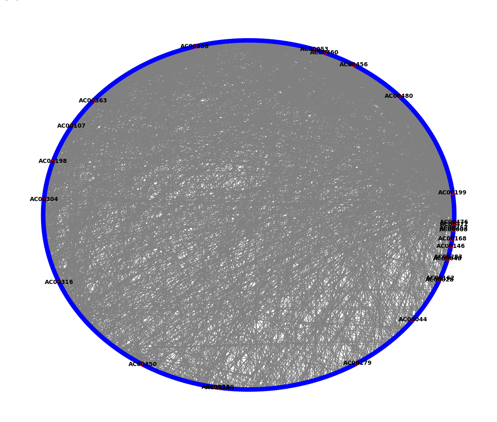

# Fraud-Detection
Fraud Detection in Financial Transactions Using Graph Analysis

Python Libraries Used:
-  Pandas
-  NetworkX
-  Sklearn
-  MatPlotLib

Anomalies:
-  Ir-regular balance of transactions
-  Transaction is unusually quick or takes much longer than usual
-  Ir-regular Frequency of transactions
-  Unusual time gap between transactions

  
  

